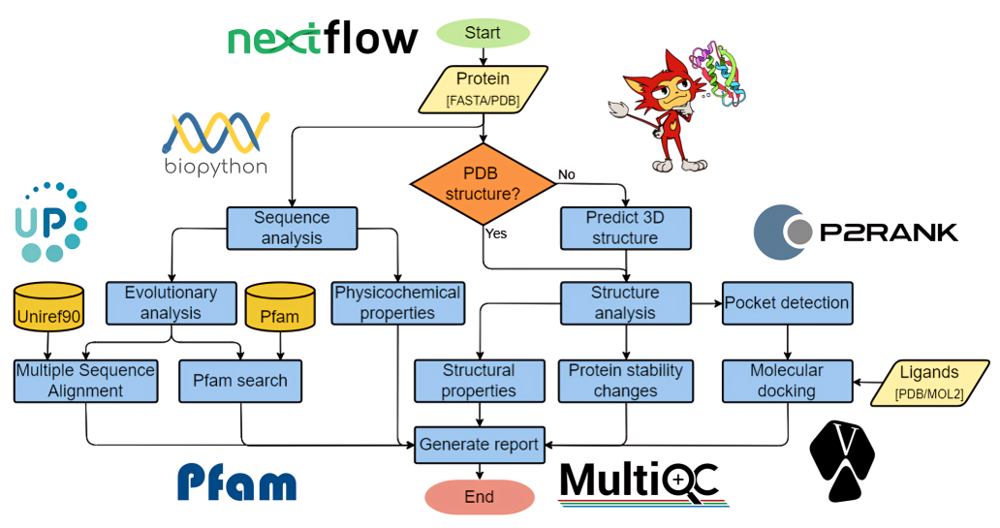

<p align="center">
 
</p>

<h2 align="center">AlphaFold-based Protein Analysis Pipeline</h2>

<div align="center">

[](.)
[](/LICENSE)

</div>

---

# 📝 Table of Contents
- [Description](#description)
- [Installation](#installation)
- [Usage](#usage)
- [Authors](#authors)
- [Acknowledgments](#acknowledgement)

# Description <a name = "description"></a>
<p align="center">
 
</p>

### This project constitutes a protein analysis pipeline that allows for a quick and comprehensive analysis of a protein sequence or structure.

- The pipeline accepts as input a protein sequence in FASTA format or a protein structure in PDB format. If a PDB file is not provided, the 3D structure of the protein can be predicted using [AlphaFold2](https://github.com/deepmind/alphafold).

- A sequence-based analysis can be performed, including determining physicochemical properties and aligning the protein sequence against other databases such as [Pfam](https://pfam.xfam.org/) and [SwissProt/UniRef90](https://www.uniprot.org/).

- A structure-based analysis can be performed, including predicting the effect of amino acid substitutions over the protein stability using [SimBa2](https://github.com/kasperplaneta/SimBa2) and the detection of binding pockets using [P2Rank](https://github.com/rdk/p2rank).

- A list of ligands can be specified in the PDB/MOL2 format. The binding affinity of the protein-ligand interactions can be predicted using [AutoDock Vina](https://github.com/ccsb-scripps/AutoDock-Vina).

- The outputs obtained during each process are aggregated into a [MultiQC](https://github.com/ewels/MultiQC) HTML report. The analysis report presents the results in an interactive manner, including visualizing the three-dimensional protein structure using the [iCn3D](https://github.com/ncbi/icn3d) web viewer. The pipeline is being developed using [Nextflow](https://github.com/nextflow-io/nextflow).

# Installation <a name = "installation"></a>
### ***IMPORTANT:** This project is under active development. Momentarily the pipeline can only be utilized by manually installing the desired packages and tools. Support for Docker/Singularity containers represents a high-priority future update.*

## Prerequisites:

<ul>
<li>Python ≥ 3.8</li>
<li>Java ≥ 11</li>
<li>git, pip, conda/mamba</li>
</ul>

## Mandatory installation:
- The minimum setup required for running the pipeline. This configuration allows for executing the sequence properties and 3D structure viewer components.
```
conda config --env --add channels conda-forge
conda config --env --add channels anaconda
conda config --env --add channels bioconda

conda install 'numpy>=1.18.5' 'pandas>=1.4.1' 'biopython>=1.76' 'multiqc>=1.12' pymol-open-source=2.5.0
conda install -c salilab dssp=3.0.0
```
- Install Nextflow and add the executable to PATH: https://github.com/nextflow-io/nextflow
```
curl -fsSL https://get.nextflow.io | bash
```
- Clone this repository:
```
git clone https://github.com/OtimusOne/AFPAP.git
```
## Optional components: 
- The following analysis steps are optional and their installation can be skipped if desired.
### 3D structure prediction - AlphaFold2/ColabFold:
- AlphaFold2 is used to predicted the protein structure if a PDB file is not provided. We use a local instance of ColabFold in order to avoid the large databases used by native AlphaFold2 implementation.
- Follow the install intructions at: https://github.com/YoshitakaMo/localcolabfold
- If ColabFold is not installed the user must provide a PDB structure using the *--pdb* argument if structural analysis is desired. Set *skipAlphaFold = true* inside **nextflow.config**.

### Pfam search:
- The Pfam database is used to match the protein sequence agains protein families.
- Download the Pfam database(~1.5GB): 
http://ftp.ebi.ac.uk/pub/databases/Pfam/current_release/
- Install the following packages:
```
conda install pfam_scan perl-json
```
- Set path variable inside **nextflow.config**
```
params {
    ...
    pfam_path="/path/to/Pfam/directory"
    ...
}
```
- If Pfam is not used set *skipPfamSearch = true* inside **nextflow.config**.

### Conservation MSA:
- The protein sequence conservation can be computed by generating a Multiple Sequence Alignment using a sequence database.
- Install Blast, Muscle and CD-HIT:
```
conda install blast muscle cd-hit
```
- Create a BLAST database from which to generate the MSA file. You can use any FASTA database such as SwissProt/TrEMBL/UniRef50/UniRef90 (https://ftp.uniprot.org/pub/databases/uniprot/current_release/).

    Example setting UniRef90 up as a Blast database: https://ftp.uniprot.org/pub/databases/uniprot/current_release/uniref/uniref90/
```
curl {https://ftp.uniprot.org/pub/databases/uniprot/current_release/uniref/uniref90/uniref90.fasta.gz} | gunzip | makeblastdb -out uniref90 -dbtype prot -title UniRef90 -parse_seqids
```
- Set path variable inside **nextflow.config**
```
params {
    ...
    blast_path="/path/to/BLASTDB/uniref90"
    ...
}
```
- *warning: SwissProt might not return enough hits to calculate the sequence conservation, downloading large databases such as TrEMBL and UniRef90 might take a lot of time*
- If this component is not used set *skipConservationMSA = true* inside **nextflow.config**.

### Protein stability changes - SimBa2:
- SimBa2 is used to predict the effect of amino-acid substitutions on protein stability.
```
python -m pip install https://github.com/kasperplaneta/SimBa2/archive/main.tar.gz
```
- If SimBa2 is not installed set *skipStabilityChanges = true* inside **nextflow.config**.

### Pocket prediction - P2Rank:
- P2Rank is used to predict ligand-binding pockets from the protein structure.
- Follow the install intructions at:
https://github.com/rdk/p2rank
- Pillow is required for generating the pocket visualizations:
```
conda install pillow
```
- If P2Rank is not installed set *skipPocketPrediction = true* inside **nextflow.config**.

### Molecular Docking - AutoDock Vina:
- AutoDock Vina is used to dock the ligands provided with the *--ligands* argument.
- Install ADFR suite - MSMS not required
https://ccsb.scripps.edu/adfr/downloads/
- Install Vina python bindings:
```
pip install vina
```
- If the pocket prediction step has been executed beforehand, Vina will dock the ligands against each of the predicted pockets, otherwise it will only execute a blind docking step.
- If Vina is not installed set *skipMolecularDocking = true* inside **nextflow.config**.

# Usage <a name="usage"></a>

Usage example:
```
nextflow run main.nf --fasta input.fasta
nextflow run path/to/main.nf --pdb input.pdb --ligands "ligand1.mol2 path/to/ligand2.pdb"
```
For a full list of parameters run:
```
nextflow run main.nf --help
```


## Authors <a name = "authors"></a>

- Maghiar Octavian-Florin

## Acknowledgements <a name = "acknowledgement"></a>
If you find this work useful please properly cite any of the revelant tools.


- **AlphaFold2**: Jumper, J. et al. (2021) ‘Highly accurate protein structure prediction with AlphaFold’, Nature, 596(7873), pp. 583–589. Available at: https://doi.org/10.1038/s41586-021-03819-2.

- **ColabFold**: Mirdita, M. et al. (2021) ColabFold - Making protein folding accessible to all. preprint. Bioinformatics. Available at: https://doi.org/10.1101/2021.08.15.456425.

- **P2Rank**: Krivák, R. and Hoksza, D. (2018) ‘P2Rank: machine learning based tool for rapid and accurate prediction of ligand binding sites from protein structure’, Journal of Cheminformatics, 10(1), p. 39. Available at: https://doi.org/10.1186/s13321-018-0285-8.

    Jendele, L. et al. (2019) ‘PrankWeb: a web server for ligand binding site prediction and visualization’, Nucleic Acids Research, 47(W1), pp. W345–W349. Available at: https://doi.org/10.1093/nar/gkz424.


- **AutoDock Vina**: Eberhardt, J. et al. (2021) ‘AutoDock Vina 1.2.0: New Docking Methods, Expanded Force Field, and Python Bindings’, Journal of Chemical Information and Modeling, 61(8), pp. 3891–3898. Available at: https://doi.org/10.1021/acs.jcim.1c00203.

    Trott, O. and Olson, A.J. (2009) ‘AutoDock Vina: Improving the speed and accuracy of docking with a new scoring function, efficient optimization, and multithreading’, Journal of Computational Chemistry, p. NA-NA. Available at: https://doi.org/10.1002/jcc.21334.


- **SimBa2**: Bæk, K.T. and Kepp, K.P. (2022) ‘Data set and fitting dependencies when estimating protein mutant stability: Toward simple, balanced, and interpretable models’, Journal of Computational Chemistry, 43(8), pp. 504–518. Available at: https://doi.org/10.1002/jcc.26810.

- **iCn3D**: Wang, J. et al. (2020) ‘iCn3D, a web-based 3D viewer for sharing 1D/2D/3D representations of biomolecular structures’, Bioinformatics. Edited by A. Valencia, 36(1), pp. 131–135. Available at: https://doi.org/10.1093/bioinformatics/btz502.

- **Nextflow**: Di Tommaso, P. et al. (2017) ‘Nextflow enables reproducible computational workflows’, Nature Biotechnology, 35(4), pp. 316–319. Available at: https://doi.org/10.1038/nbt.3820.

- **MultiQC**: Ewels, P. et al. (2016) ‘MultiQC: summarize analysis results for multiple tools and samples in a single report’, Bioinformatics, 32(19), pp. 3047–3048. Available at: https://doi.org/10.1093/bioinformatics/btw354.

- **BLAST**: Camacho, C. et al. (2009) ‘BLAST+: architecture and applications’, BMC Bioinformatics, 10(1), p. 421. Available at: https://doi.org/10.1186/1471-2105-10-421.

- **CD-HIT**: Fu, L. et al. (2012) ‘CD-HIT: accelerated for clustering the next-generation sequencing data’, Bioinformatics, 28(23), pp. 3150–3152. Available at: https://doi.org/10.1093/bioinformatics/bts565.

- **MUSCLE**: Edgar, R.C. (2004) ‘MUSCLE: multiple sequence alignment with high accuracy and high throughput’, Nucleic Acids Research, 32(5), pp. 1792–1797. Available at: https://doi.org/10.1093/nar/gkh340.
